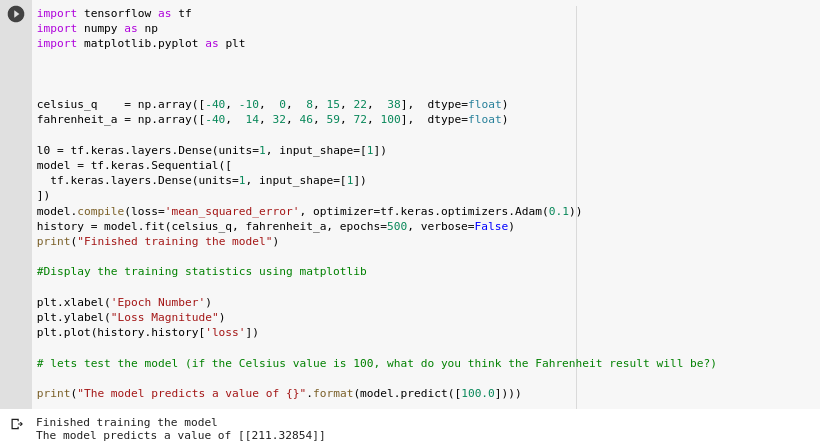

<p align="center"></p>

<div align="center">

[](https://github.com/Aman-zishan/Intro-to-ML-tensorflow) 
[](https://github.com/Aman-zishan/Intro-to-ML-tensorflow/stargazers)


</div>

*This Repository contains the notes and code snippets from the "Intro to tensorflow for deep learning" course from Udacity.*

**Artificial Intelligence** : A field of computer science that aims to make computers achieve human-style intelligence. There are many approaches to reaching this goal, including machine learning and deep learning.

- *Machine Learning*: A set of related techniques in which computers are trained to perform a particular task rather than by explicitly programming them.

- *Neural Network*: A construct in Machine Learning inspired by the network of neurons (nerve cells) in the biological brain. Neural networks are a fundamental part of deep learning, and will be covered in this course.

- *Deep Learning*: A subfield of machine learning that uses multi-layered neural networks. Often, “machine learning” and “deep learning” are used interchangeably.

<p align="center"></p>

Why **Machine Learning?**

*Traditional Software Development*: The input and the algorithm is known, and you write function to produce an output.

- Input Data
- Apply logic to it
- Get output / result

Whereas in *machine learning* You know the input and output, but you don't know the algorithm  that creates the output given the input.

- Take pair of input and output data
- Figure out the algorithm

<p align="center"></p>

Some *machine learning* terminologies:

- **Feature** : The input(s) to our model.

- **Label** : The output our model predicts.

- **Example** : A pair of inputs/outputs used during training.

## The basics : Training your first model

The problem we will solve is to convert from Celsius to Fahrenheit, where the approximate formula is:

f=c×1.8+32 

Of course, it would be simple enough to create a conventional Python function that directly performs this calculation, but that wouldn't be machine learning:robot:.

Instead, we will give TensorFlow some sample Celsius values (0, 8, 15, 22, 38) and their corresponding Fahrenheit values (32, 46, 59, 72, 100). Then, we will train a model that figures out the above formula through the training process. :wink:


## Creating a model (To convert Celsius to Fahrenheit)

**Build a layer**
- We'll call the layer l0 and create it by instantiating tf.keras.layers.Dense with the following configuration:

- input_shape=[1] — This specifies that the input to this layer is a single value. That is, the shape is a one-dimensional array with one member. Since this is the first (and only) layer, that input shape is the input shape of the entire model. The single value is a floating point number, representing degrees Celsius.

- units=1 — This specifies the number of neurons in the layer. The number of neurons defines how many internal variables the layer has to try to learn how to solve the problem (more later). Since this is the final layer, it is also the size of the model's output — a single float value representing degrees Fahrenheit. (In a multi-layered network, the size and shape of the layer would need to match the input_shape of the next layer.)

```
#Tensorflow model part
...

l0 = tf.keras.layers.Dense(units=1, input_shape=[1])
model = tf.keras.Sequential([l0])
model.compile(loss='mean_squared_error', optimizer=tf.keras.optimizers.Adam(0.1))
history = model.fit(celsius_q, fahrenheit_a, epochs=500, verbose=False)
model.predict([100.0])

```

<p align="center"></p>
<p align="center"></p>

<p align="center"></p>

